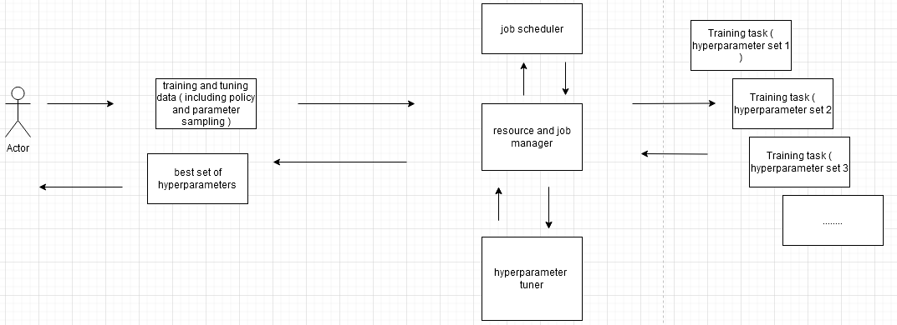

# Optimizing an ML Pipeline in Azure

## Overview
This project is part of the Udacity Azure ML Nanodegree.
In this project, we build and optimize an Azure ML pipeline using the Python SDK and a provided Scikit-learn model.
This model is then compared to an Azure AutoML run.

## Summary
**In 1-2 sentences, explain the problem statement: e.g "This dataset contains data about... we seek to predict..."**

This dataset contains data about is used for markering to predict if a client will subscribe to a bank term desposit

**In 1-2 sentences, explain the solution: e.g. "The best performing model was a ..."**

The best performing model was a Ensemble algorithm, Voting Ensemble, proposed by AutoML

## Scikit-learn Pipeline
***Explain the pipeline architecture, including data, hyperparameter tuning, and classification algorithm.***

Hyperparemters are optimized against the primary metric, in this case Accurracy. A search space is defined for each hyperparameter by chosing a parameter sampling method. The data is a classification problem
where the user is either a potential subsriber or not. As such a classification algorithm is used in the training script; LogisticRegression. The pipeline tries several parallel runs to tune the hyperparameters and come up with the
best model.

### **Architecture**

### **The dataset**

The dataset got the following features:

*Basic information*

Age,Job,Martial,Education,Default(got credit),Housing,Loan

*Last time contacted* 

Contact(type of communicating device),Month,Dayofweek,Duration
¨
*Campaign specific information*

Campaign(number of contacts performed under this campaign),Pdays(days since last contact),Previous(number of contacts before campaign),Poutcome(number of previous campaign contacts)

*social and economic information*

Emp.var.rate(employment variation rate),Cons.price.idx(consumer price index),Cons.conf.idx(consumer confidence index),Euribor3m(euriboe 3 month rate),Nr.employed(number of employees)

*Output and target feature*

y(has the client subscribed a term deposit?)

### **Data cleaning**

The dataset is prepared in the training script by a cleaning script. The following features are scrubbed:

The following categorial data is converted into dummy variables:
Job,Contact,Education.
The following categorial data is hot encoded:
Martial,Default,Housing,Loan,Month,Dayofweek,poutcome,y

### **Hyper parameter tuning**

The following hyperparamters are tuned in the Hyperdrive pipeline:
"--C" From 0 to 1  - regularization parameter. A smaller value represent a stronger regularization.   
"--Max_inter" From 0 to 100 - Maximum number of iterations to solve the convergence. 

**What are the benefits of the parameter sampler you chose?**

RandomParameterSampling has the advantage for early termination by low performance runs. If a more throughout result is required you can then refine the search to improve results.

**What are the benefits of the early stopping policy you chose?**

Banditpolicy makes sure to stop the run if the primary metric is not within the slack factor/amount comparted to the best performing run. In my notebook I went by slack factor.

## AutoML
**In 1-2 sentences, describe the model and hyperparameters generated by AutoML.**

AutoML genereated a Voting Ensemblem model, which by soft voting determine the weights aswell as hyperparameters of the base classififers. In this case a RandomForestClassifier
The best fitted model uses the following hyperparameters:

min_samples_split=0.15052631578947367 - the minimum number of samples required to split a internal node
min_weight_fraction_leaf=0.0 - the minimum weighted fraction of the sum total of weights required to be at a leaf node
n_estimators=10 - the number of trees in the forest
n_jobs=1 - the number of jobs to run in parallel
oob_score=False - not used in this run
random_state=None - not used in this run
verbose=0 - controls the verobisity when fitting and predicitng
warm_start=False - not used in this run

## Pipeline comparison
**Compare the two models and their performance. What are the differences in accuracy? In architecture? If there was a difference, why do you think there was one?**

The accuracy for the AutoML model ran to 0.91680
The accuracy for the HyperDrive model ( LogisticRegression ) ran for 0.91420 with a --C of 0.1 and a --max_iter of 100

Both pipelines are similair in that they do. Both do hyperparameter tuning but the difference is that HyperDrive does this for one algorithm in a single pipeline while AutoML search a space of machine learning pipelines with different
algorithms and hpyerparameter configurations. It then weights these against eachother to present a optimized solution. However this does take a lot more time and performance in comparsion to a single hyperdrive pipeline.
## Future work

**What are some areas of improvement for future experiments? Why might these improvements help the model?**
We can run a more refined search for the hyperdrive with another parameter sampler. The hyperdrive pipeline could also increase its maximum amount of runs and include more hyperparameters.
For the AutoML run there is the possibility to increase the amount of n cross validations or try another priamry metric to decide a better model.